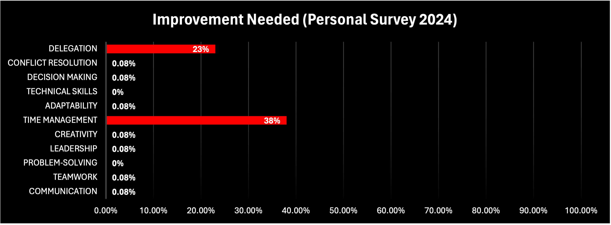

# Hi there 👋 I am Saif...  

## 🚀 About Me  
I am a **Senior Director/Engineering Manager** with **5+ years of experience** in **DevOps, CI/CD automation**, and **Data Science**. I specialize in **cloud-native technologies**, building scalable platforms, and leading cross-functional teams to drive innovation.  

I am **CKAD certified** with expertise in **Python backend development**, **machine learning**, and **business strategy**. Currently, I’m pursuing an **MBA in International Business** while driving impactful solutions in the tech industry.  

## What My Team Think About Me?

  
  

---

## 🌟 Current Work Experience  

As a **Senior Director at Rakuten Symphony**, I lead a team of professionals to deliver cutting-edge solutions in **CI/CD automation** and **DevSecOps** for the **telecom industry**.  

### Key Contributions:  
- **Architected a Cloud-Native CI/CD Platform**: Delivered a highly available on-prem solution that reduced operational costs by over 30% and supported thousands of daily builds.  
- **Optimized CI/CD Pipelines**: Designed multi-stage pipelines for various technologies, cutting build times by 90% and improving deployment efficiency.  
- **Standardized CI/CD Practices**: Introduced versioning, branching strategies, and automated releases for seamless end-to-end workflows.  
- **Enhanced Software Delivery**: Established a global distribution network to reduce software delivery time by 99% and enabled 30+ releases per week.  
- **Automated Monitoring and Metrics**: Developed a KPI dashboard tracking deployment frequency, lead time, MTTR, and change failure rates, ensuring continuous improvement.  
- **Streamlined Operations**: Automated complex tasks, reducing operational team size and enabling faster issue resolution in Kubernetes and CI/CD toolsets.  
- **Cross-Functional Leadership**: Collaborated with product, security, cloud, and QA teams to deliver projects on time while ensuring scalability and reliability.  

---

## 📚 Past Work Experience  

### **Data Scientist**  
- **Machine Learning Models**: Built demand forecasting models using **XGBoost, ARIMA**, and other algorithms, achieving accuracy over **97% for 7-day forecasts**.  
- **Computer Vision Applications**: Developed solutions using **YOLOv5** and **RetinaNet** for congestion detection with 95%+ accuracy.  
- **IoT Solutions**: Built real-time environmental trackers integrating **AWS IoT** and **Raspberry Pi**, enabling actionable insights.  
- **Data Visualization**: Designed dashboards with **PowerBI, Tableau**, and **SPLUNK**, providing critical business insights for stakeholders.  
- **Multi-Modal Data Integration**: Facilitated mobility trend analysis by integrating data from micro-mobility, public transport, and parking systems.  

---

## 🔧 Tech Stack  

### **Programming Languages**  
  
  
  
  

### **Cloud and Containerization**  
  
  
  
  

### **DevOps Tooling**  
  
  
  
  

### **Frameworks and Libraries**  
  
  
  
  

### **Databases**  
  
  
  

---

## 📫 Contact  
💬 **Ask Me About**: DevOps, Cloud-Native Platforms, Data Science, or Business Strategy!  
📧 **Email**: [contact@sarwarsaif.com](mailto:contact@sarwarsaif.com)  
🌐 **Portfolio**: [sarwarsaif.com](https://www.sarwarsaif.com)  

---

### 🌐 Social Links  
  
  
  
